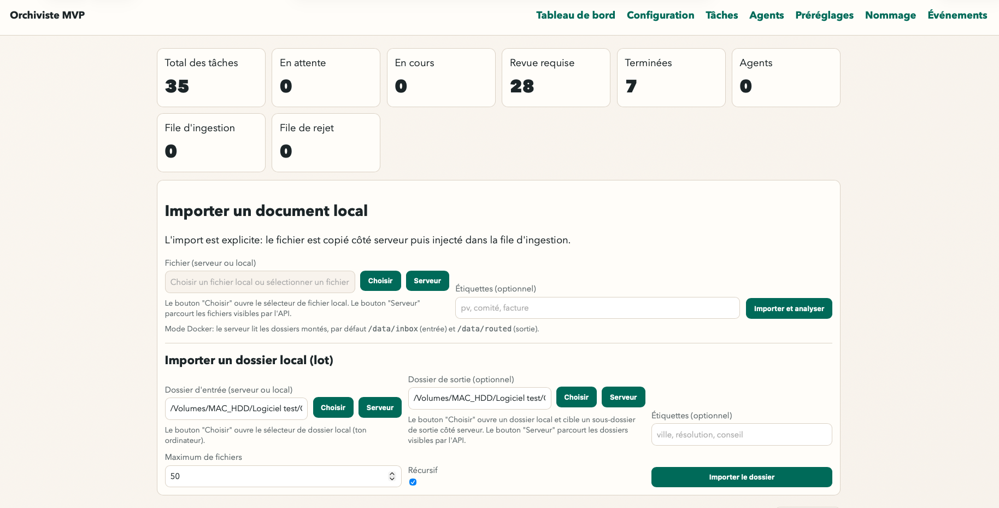
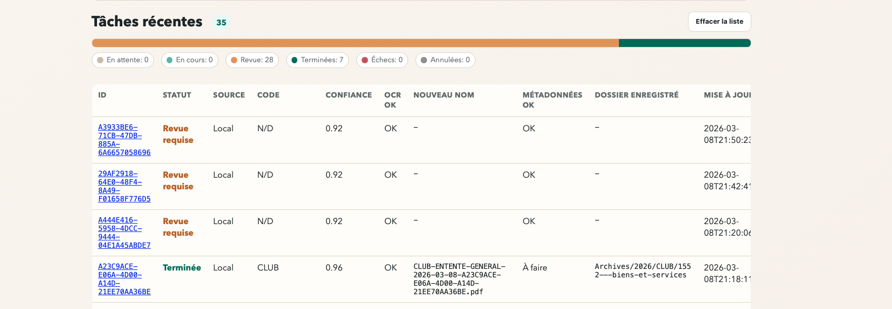
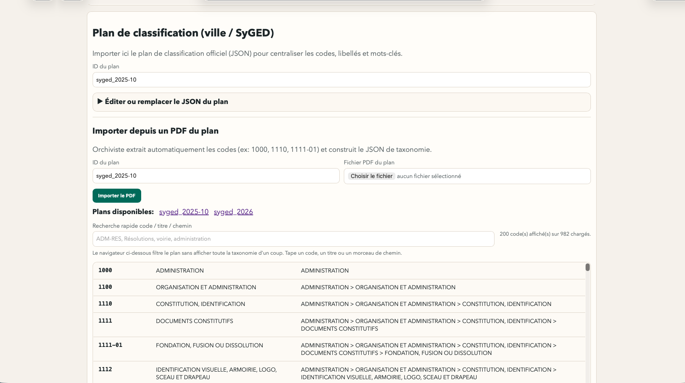
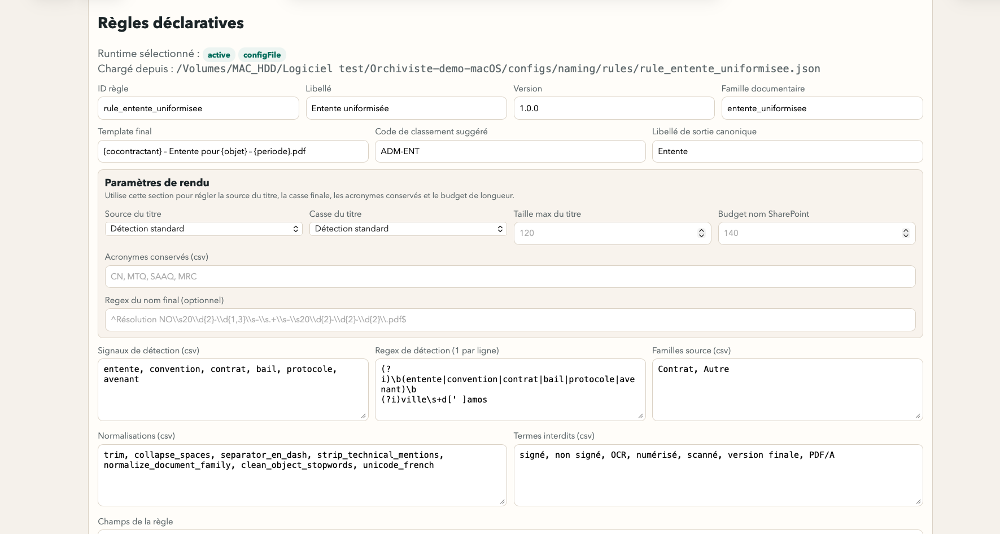

# Orchiviste

Orchiviste est une plateforme documentaire municipale orientée `Analyse -> Renommage -> Classement/Routage`, construite en monorepo Swift Package Manager + Vapor.

## Mission

Orchiviste est une plateforme de traitement documentaire municipal conçue pour aider le travail d'archiviste: transformer des lots hétérogènes en documents analysés, nommés, classés et traçables.

Flux opérationnel: ingestion -> aperçu serveur -> extraction contenu/métadonnées -> proposition de nom -> classement/routage (local/SharePoint) -> revue humaine si confiance insuffisante.

## Valeur apportée

- réduit les manipulations manuelles de renommage et de classement
- applique des règles métier déclaratives, modifiables sans recoder
- conserve une traçabilité complète (événements, raisons de revue, historique)
- priorise un fonctionnement local macOS (Apple Silicon) pour OCR/analyse
- sépare la décision automatique de la validation humaine (`needs_review`)

## Positionnement

Par rapport aux outils OCR/IDP/EDMS génériques, Orchiviste cible l'usage archivistique municipal avec:

- rôle de cockpit/hub de l'écosystème
- orchestration des outils spécialisés sans fusion des dépôts (`MuniRenommage`, `MuniConversion`, `MuniMiseEnForme`, `MuniAnalyse`, `MuniMetadonnees`, `MuniPreclassement`, `MuniControle`)
- règles de nommage métier + préréglages orientés administration publique
- extraction de métadonnées utiles au classement documentaire
- routage intégré vers arborescence cible et SharePoint
- workflow de revue auditable pour les cas ambigus

## Capacites cockpit V1 (release 0.3.0)

- catalogue outillage unifie avec mission, version, statut d'integration et capacites par outil
- lancement canonique OrchivisteKit (`run --request <file> --result <file>`) depuis API/UI
- historique local `history.jsonl` des executions cockpit
- garde-fous explicites pour actions potentiellement destructives
- outils `active` dans le cockpit:
  - `MuniAnalyse` (`0.2.0`)
  - `MuniMetadonnees` (`0.2.0`)
  - `MuniPreclassement` (`0.2.0`)
  - `MuniControle` (`0.2.0`)

## Principes de nommage

- nom significatif, précis et concis
- longueur visée courte, limite technique gérée côté moteur
- aucune mention technique dans le nom final (`signé`, `numérisé`, `OCR`, `PDF/A`, etc.)
- en cas d'incertitude, passer en `needs_review` plutôt qu'inventer

## Méthodologie de développement

Le projet est piloté par le besoin métier archivistique et développé dans `Visual Studio Code`, avec assistance d'IA (`OpenAI Codex`/`ChatGPT`) sous supervision humaine.

Les décisions fonctionnelles, la validation des règles de nommage, la revue des résultats et la gouvernance documentaire restent sous contrôle humain.

## Cible d'exécution

Le produit est pensé `macOS native-first`.

- `OrchivisteWorker` est un binaire macOS
- `OrchivisteAnalyse` peut exploiter `FoundationModels` et `CoreML` sur macOS
- Docker reste utile pour des smokes et une démo technique, mais le conteneur Linux n'active pas les frameworks Apple natifs

## Modules

- `OrchivisteAPI`: API Vapor, UI SSR Leaf, preview, presets, jobs, events/webhooks, routage local et Graph
- `OrchivisteAnalyse`: service d'analyse sémantique et de fusion, avec signaux `capture` et `review`
- `OrchivisteWorker`: worker CLI macOS/Redis pour OCR et traitements asynchrones
- `OrchivisteSharedKit`: DTO partagés

## Périmètre MVP livré

- ingestion locale et SharePoint
- preview serveur sans téléchargement par défaut
- analyse avec `needs_review` si confiance faible ou ambiguïté métier
- presets JSON, exemple téléchargeable et apprentissage depuis dossier
- support MVP PDF, images et documents Office
- routage local et SharePoint Graph
- option d'export PDF/A-2b avec fallback journalisé
- OpenAPI 3.1, `/v1/events`, webhooks HMAC, métriques et smoke tests

## Démarrage rapide

Local:

```bash
cd OrchivisteAnalyse
swift build -c debug --product OrchivisteAnalyse

cd ../OrchivisteAPI
swift build -c debug --product OrchivisteAPI

cd ..
./scripts/preflight_local.sh --full
```

Docker:

```bash
docker compose up -d --build redis analyse api
./scripts/check_openapi_mvp.sh
./scripts/smoke_mvp.sh
```

Pour utiliser `FoundationModels` et `CoreML`, lance `OrchivisteAnalyse` nativement sur macOS au lieu du conteneur `analyse`.

## Démo macOS (dossier externe recommandé)

Dossier de démo recommandé:

`/Volumes/MAC_HDD/Logiciel test/Orchiviste-demo-macOS`

Construire/mettre à jour la démo:

```bash
./scripts/build_native_demo_bundle.sh "/Volumes/MAC_HDD/Logiciel test/Orchiviste-demo-macOS"
```

Démarrer la démo:

```bash
"/Volumes/MAC_HDD/Logiciel test/Orchiviste-demo-macOS/start-orchiviste.sh"
```

Arrêter la démo:

```bash
"/Volumes/MAC_HDD/Logiciel test/Orchiviste-demo-macOS/stop-orchiviste.sh"
```

UI:

- `http://127.0.0.1:28780/ui`
- alias `http://127.0.0.1:28780/u`

## Documentation

- API et exploitation: [OrchivisteAPI/README.md](OrchivisteAPI/README.md)
- Analyse sémantique: [OrchivisteAnalyse/README.md](OrchivisteAnalyse/README.md)
- Déploiement Mac mini: [deploy/mac-mini/README.md](deploy/mac-mini/README.md)
- Roadmap produit et technique: [ROADMAP.md](ROADMAP.md)
- Feuille de route ML: [ml/IMPLEMENTATION_PLAN.md](ml/IMPLEMENTATION_PLAN.md)

## Captures d'écran

### Tableau de bord (import)



### Tableau de bord (tâches récentes)



### Préréglages (plan de classification)



### Nommage (règles déclaratives)



## Validation recommandée

```bash
./scripts/check_openapi_mvp.sh
./scripts/smoke_analyse_semantic.sh
./scripts/smoke_regression_dataset.sh
./scripts/smoke_graph_router.sh
./scripts/smoke_webhook_hmac.sh
./scripts/smoke_mvp.sh
```

## Licence

Ce projet est distribué sous licence `GNU GPL v3.0`.
Voir [LICENSE](LICENSE).

## Versionnage

Ce dépôt suit `Semantic Versioning`.
Release actuelle: `0.3.0` (2026-03-16).
Points majeurs de `0.3.0`: cockpit V1 officialise avec activation de `MuniAnalyse`, `MuniMetadonnees`, `MuniPreclassement` et `MuniControle` en statut `active`.

La branche `main` est la branche livrée. Les PR empilées existantes servent de support de review et ne reflètent pas nécessairement l'état intégral courant.
